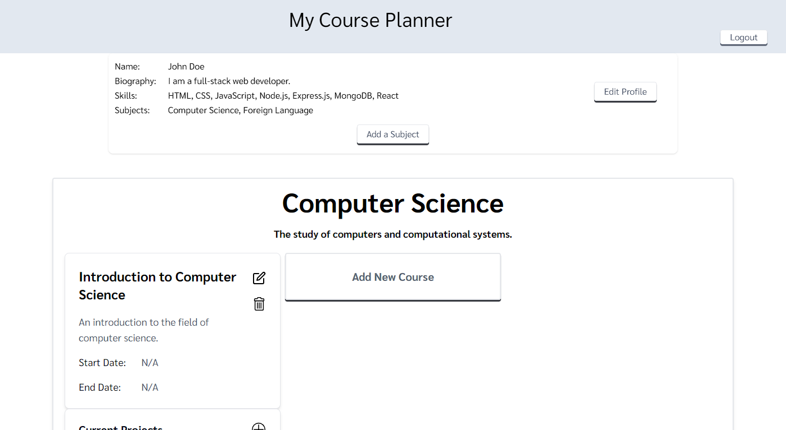

# Self Guided Learning: Course Planner

## Screenshot

## Description
Welcome to our project, crafted as part of the Northwest Coding Bootcamp. This React-based application embodies the culmination of our learning journey. Designed with a focus on self-guided education, it offers a customizable platform for users to explore and deepen their knowledge in various subjects.

### Application Features
- **Personalized Learning Paths:** Users can select subjects of interest and add relevant courses to their personal learning dashboard.
- **Course and Project Management:** Within each course, users have the flexibility to add and organize projects, facilitating hands-on learning.
- **User-Centric Operations:** Our application supports complete user control, allowing for the addition, modification, and deletion of courses and projects.
- **Interactive and Responsive Design:** Leveraging Tailwind CSS, the UI is intuitive, sleek, and responsive, ensuring a seamless user experience.

### Technology Stack
- **React:** For building a dynamic and interactive UI.
- **GraphQL:** Providing a flexible and efficient API for data queries and manipulations.
- **MongoDB:** A NoSQL database, chosen for its scalability and flexibility in handling diverse data types.
- **JWT Authentication:** Ensures secure user access and data protection.
- **Tailwind CSS:** For stylish, responsive, and customizable design elements.

### Purpose
This project serves as a testament to the skills and knowledge we have acquired during our bootcamp. It is not just a learning management tool but also a reflection of our growth as developers.

## Table of Contents
  - [Installation](#installation)
  - [Usage](#usage)
  - [Contribution](#contribution)
  - [Testing](#testing)
  - [License](#license)
  - [Links](#Links)

 ## Installation 
 To install this application, git clone thie repository to your local computer. The user must also install Node.js in order to use this application.

 ## Usage
This application is deployed to heroku, you can follow the link below to navigate to the site.

## Contribution
This application is a project for Northwest Coding Bootcamp and is complete, there is no need for any contributions.

## Testing
You can test this application  by running the command line prompt "npm start" after installing the required node packages from VS code and using live preview to demo the application on your local drive.

## Licenses
This project is not covered under any licenses.

## Links
Git Hub: https://github.com/bklein1981/Course-Planner

Deployed Site: 
